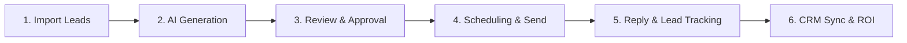

# Zirium AI — Cold Email Outreach Workflow & Results Specification

This document provides a comprehensive end-to-end technical guide explaining how the cold email outreach pipeline works, how data flows through each subsystem, and what results/outputs are produced at every stage.

---

## 1. High-Level Architecture & Pipeline Overview

The outreach engine is structured into five core sequential phases supported by enterprise intelligence tabs:



---

## 2. Step-by-Step Detailed Workflow & Results

### Step 1: Lead Data Ingestion (Import)
- **User Action**: The user drags & drops or browses a lead file (`.csv`, `.xlsx`, `.xls`, `.pdf`, `.docx`, or `.txt`) into the **Import Section**.
- **System Execution**:
  1. Handled by `/api/import` and parsed via `lib/csv.js`.
  2. For tabular files (`CSV`/`Excel`), columns are normalized (`Company Name`, `Email`, `Website`, `Phone`).
  3. For documents (`PDF`/`Word`/`TXT`), natural language entity extraction identifies company names, emails, and phone numbers.
  4. Records are saved into the `companies` database table (`lib/db.js`).
- **Result / Output**:
  - **Database Result**: New rows in `companies` table with `id`, `name`, `website`, `contact_email`, `all_emails`, `phone`.
  - **UI Result**: Instant update of the **Companies List** table with lead counts (e.g., `50 total`) and status `no draft`.
  - **Toast Notification**: `Successfully imported X companies from "leads.csv"`.

---

### Step 2: Sender Identity & Email Signature Setup
- **User Action**: Select a sender key (e.g., Wahaj, Info, Haseeb) in the **Email Signature Section**, enter signature details (Name, Title, Tagline, Website, Calendly / Meeting Link, Zirium logo toggle), and click **Save Signature**.
- **System Execution**:
  1. Handled by `/api/settings`.
  2. Stores sender configurations and signature templates mapped to `sender_key` in the `settings` database table.
  3. Formats HTML signature via `lib/signature.js` to render a styled `📅 Schedule a Meeting` call-to-action button when a Calendly URL is specified.
- **Result / Output**:
  - **Database Result**: Signature parameters including `sig_calendly` saved per sender key.
  - **UI Result**: Live HTML signature preview box renders the formatted signature block and meeting button.
  - **Email Output**: At send time, the signature with the meeting scheduling button is embedded in outgoing emails automatically.

---

### Step 3: AI Email Generation (Custom & Automatic Crawl Modes)
- **User Action**:
  - **Single Company**: Click **Custom** next to a company in the table.
  - **Batch Generation**: Click **Custom Generate** at the top of the Companies section to generate drafts for all pending leads.
  - Enter custom prompt instructions (e.g., *Under 90 words, friendly tone, pitch AI shopping assistant*).
- **System Execution**:
  1. Request sent to `/api/generate`.
  2. **Custom Mode**: Bypasses full web crawling and utilizes DeepSeek AI (`lib/deepseek.js`) to tailor the user prompt specifically for the target company.
  3. **Auto-Crawl Mode**: Invokes `lib/crawlSite.js` / `lib/fetchSite.js` to extract target website value propositions, key services, and team details before generating personalized emails.
  4. Inserts a new draft entry linked to `company_id`.
- **Result / Output**:
  - **Database Result**: Row created in `drafts` table with:
    - `status`: `'pending'`
    - `subject`: AI-generated compelling subject line
    - `body`: Tailored email copy
    - `research_summary`: Extracted context & company insights
  - **UI Result**: Draft appears in the **Review Queue (Drafts)** under the `pending` filter. Company status badge changes to `pending`.

---

### Step 4: Review Queue & Approval Workflow
- **User Action**:
  - Click on a draft card or select it from the **Focused Draft** dropdown.
  - Inspect subject, body, sender identity, and research notes.
  - Edit text directly if desired and click **Save Edits**.
  - Click **Approve** (or click **Approve All Pending** for batch processing).
  - Alternatively, click **Reject** to discard.
- **System Execution**:
  1. Requests sent to `/api/drafts` (`PATCH`).
  2. Updates draft content and updates status state transition.
- **Result / Output**:
  - **Approved Draft**: Status changes to `'approved'` (`Badge: Approved`).
  - **Rejected Draft**: Status changes to `'rejected'` (`Badge: Rejected`).
  - **Action Unlocks**: Approving unlocks **Send Now** and **Schedule** action buttons for that draft.

---

### Step 5: Email Dispatch & Timezone-Aware Scheduling

#### Option A: Send Now (Immediate Dispatch)
- **User Action**: Click **Send Now** on an approved draft (or click **Send All Approved**).
- **System Execution**:
  1. Request sent to `/api/send`.
  2. Fetches SMTP credentials for the selected `sender_key` via `lib/senders.js`.
  3. Generates unique tracking ID (`lib/mailer.js`).
  4. Injects tracking pixel (`/api/track/open?id=...`) and rewrites href links (`/api/track/click?id=...&url=...`).
  5. Sends email via Nodemailer SMTP.
  6. Updates draft status to `'sent'`.
- **Result / Output**:
  - **Email Delivered**: Email lands in prospect's inbox signed with sender's identity.
  - **Database Result**: `drafts.status = 'sent'`, `sent_at = UTC timestamp`, `tracking_id = unique_uuid`.
  - **UI Result**: Card locked for edits, badge updated to `Sent` with active tracking stats pill (`Opens: 0`, `Clicks: 0`).

#### Option B: Timezone-Aware Scheduling
- **User Action**: Click **Schedule** on an approved draft, pick date & time (or select a quick preset like *Tomorrow 9 AM*), choose target US Timezone (e.g., `America/New_York`), and confirm.
- **System Execution**:
  1. Converts wall-clock local time in target timezone to UTC epoch milliseconds (`wallToUtcMs`).
  2. Request sent to `/api/schedule`.
  3. Database row updated: `status = 'scheduled'`, `scheduled_at = UTC ISO`, `scheduled_tz = Timezone`.
  4. Background Scheduler Daemon (`lib/scheduler.js`) runs periodically every 30 seconds to check for due emails (`scheduled_at <= NOW()`) and dispatches them automatically.
- **Result / Output**:
  - **Database Result**: `drafts.status = 'scheduled'` -> automatically transitions to `'sent'` upon scheduled time arrival.
  - **UI Result**: Schedule badge displays: `Scheduled for [Date Time] (Target Zone) · [UTC Time]`.

---

### Step 6: Real-time Engagement & Open/Click Tracking
- **System Execution**:
  - **Email Open**: When prospect opens email, the hidden 1x1 image requests `/api/track/open?id=X`. Server increments `open_count` and updates `last_opened_at`.
  - **Link Click**: When prospect clicks a link, request hits `/api/track/click?id=X&url=Y`. Server increments `click_count`, updates `last_clicked_at`, and redirects prospect seamlessly to the destination URL.
- **Result / Output**:
  - **Database Result**: `open_count`, `click_count`, `last_opened_at`, `last_clicked_at` live updated.
  - **UI Result**: Tracking pill on Draft card updates in real-time without needing page refresh (polling every 10s).

---

### Step 7: Reply Detection & Pipeline CRM Management
- **System Execution**:
  1. Background IMAP poller (`lib/replies.js`) checks sender inboxes every 3 minutes (or triggered manually via **Check Replies Now**).
  2. Matches incoming reply `In-Reply-To` header, `subject`, or `from_email` against sent drafts.
  3. When a match is found:
     - Creates a record in `replies` table.
     - Updates associated draft status to `'replied'`.
     - Updates company draft status to `'replied'`.
- **User Action**:
  - Open **Replies Section** or view the green **Email Reply Received** callout banner on the Draft card.
  - Change lead stage dropdown: `New` ➔ `Interested` ➔ `Meeting Booked` ➔ `Won` / `Lost`.
  - Add internal notes (e.g. *Sent proposal, meeting on Tue*) and click **Save**.
- **Result / Output**:
  - **Pipeline State**: Lead advances through sales pipeline stages with custom colored status tags.
  - **Lead Scoring**: Lead score updated automatically based on engagement and reply sentiment (`lib/leadScoring.js`).
  - **CRM Integration**: Automatic webhook payload dispatched to CRM / Slack (`lib/crm.js`).

---

## 3. Enterprise Intelligence Views Summary

| Tab View | Purpose | Core Results & Outputs |
| :--- | :--- | :--- |
| **Outreach Pipeline** | Main campaign operational hub | Lead import, AI draft generation, approval queue, scheduling, tracking, replies. |
| **Deliverability & Health** | Domain reputation & Inbox placement | DKIM/SPF/DMARC checks, bounce rates, domain health score. |
| **Branching Sequences** | Automated multi-step follow-ups | Automated follow-up sequences based on non-opens or non-replies. |
| **Compliance & Spam** | CAN-SPAM / GDPR verification | Unsubscribe link validation, spam word detection score. |
| **AI Unified Inbox** | Single inbox for all senders | Unified reply thread view across multiple sender email accounts. |
| **Lead Scoring & Copilot** | Prospect prioritization | Score leads 0–100 based on title, company size, clicks, and reply intent. |
| **CRM & Webhooks** | External tool synchronization | Real-time webhook push to HubSpot, Salesforce, Pipedrive, or Zapier. |
| **Security & Audit** | Compliance logs | Immutable log of all email sends, logins, and settings modifications. |
| **Revenue ROI** | Campaign financial analytics | Track booked meetings, pipeline value ($), closed deals, and ROI %. |

---

## 4. End-to-End State Transition Lifecycle

```
[Imported Lead] ──> [no draft]
       │
       ▼ (Generate AI Draft)
  [pending] ──> (User Edits/Approve) ──> [approved] ──> (User Reject) ──> [rejected]
                                            │
                      ┌─────────────────────┴─────────────────────┐
                      ▼                                           ▼
                 (Send Now)                                  (Schedule)
                      │                                           │
                      ▼                                           ▼
                   [sent] <─────────────────────────────── [scheduled]
                      │
        ┌─────────────┴─────────────┐
        ▼                           ▼
(Prospect Opens/Clicks)      (Prospect Replies)
  Opens: +1 / Clicks: +1            │
                                    ▼
                                [replied]
                                    │
                                    ▼ (Lead Deal Stages)
                    [Interested ➔ Meeting Booked ➔ Won]
```
